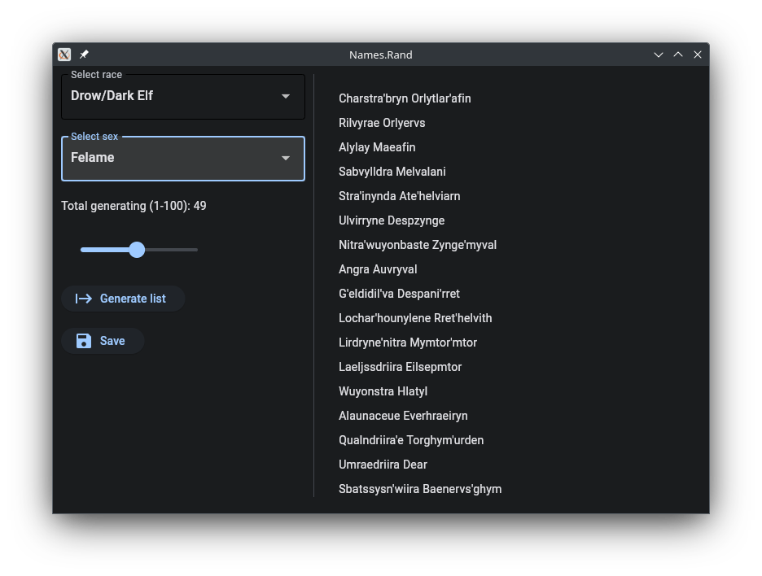

# Names.rand


[](https://ci.appveyor.com/project/son-link/names-rand)




Generates names for various fantasy races, and, in the future, names in different languages.

Available for Linux, Windows and Mac OS. In the future it will also be available for Android.

Under the GNU/GPLv3 or newer license.

Make with :heart:, [Python](https://www.python.org/) and [Flet](https://flet.dev)

&copy; 2024 Alfonso Saavedra "Son Link"

## Fantasy races:

* Demons
* Dragons
* Drows / Dark elfs
* Dwarven
* Elfs
* Gnomes
* Halflings
* Orcs

## How to use

#### Executables

To make it work just download the zip for your operating system, give run permissions (only necessary for the GNU/Linux executable) and double click on it.

#### From source

This requires Python version 3.x (recommended minimum 3.8), as well as the package flet

```sh
python3 main.py
```
